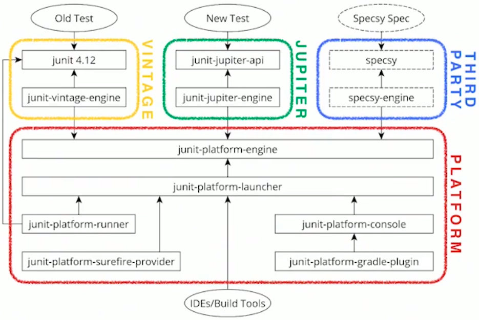

# JUnit Launcher and TestEngine

## Brief introduction on the new architecture
When JUnit 4 was released in 2006, it provided a simple and monolithic architecture: all its functionality was concentrated inside a single big JAR file. This choice caused:

- APIs were not flexible and tools like IDE had to inspect internals of JUnit classes and use reflection in order to get needed information.
- APIs evolution was seriously reduced because of this tight coupling. 

To face these issues, JUnit 5 framework is distributed with several modules, as in the following image:



The new modular approach allows the separation of different concerns:

- IDEs and tools can now easily discover and run tests by interfacing with the `junit-platform-launcher`.
- If you need to write a framework that requires writing a new test engine, you need to interface with `junit-platform-engine`.
- The end user writes tests helped by the APIs made public by each third-party programming model, without having to deal with the platform modules.

## Why do I need a Custom JUnit5 Engine
Most of the cases having tests in the form of Java classes is enough, and this is already covered by `JUnit Vintage` and `JUnit Jupiter` test engines. However, you might need to run tests written in a DSL, like in the case of Cucumber with Gherkin syntax, or just discover tests that are auto-generated or downloaded at runtime. 

---

## What is the difference between [`Launcher`](https://junit.org/junit5/docs/current/api/org.junit.platform.launcher/org/junit/platform/launcher/Launcher.html) and [`TestEngine`](https://junit.org/junit5/docs/current/api/org.junit.platform.engine/org/junit/platform/engine/TestEngine.html)?
They are both interfaces but the `Launcher` is the entry point for client code that wishes to discover and execute tests using one or more test engines. It has two main responsibilities:

- Determining the set of test engines to use at runtime
- Ensuring that each test engine has a unique ID.

The `TestEngine` facilitates discovery and execution of tests for a particular programming model. We already saw two concrete implementations:

- `JUnit Vintage`(`junit-vintage-engine`), which can discover and run tests written in the “old” JUnit 3 and 4 style
- `JUnit Jupiter`(`junit-jupiter-engine`) which supports the new programming model introduced in JUnit 5.

Actually, there is another "engine", `junit-platform-suite-engine`, to execute declarative suites of tests with the launcher infrastructure. With `junit-platform-suite-api` you can setup a test suite, instead of using the vintage engine with the `@RunWith(JUnitPlatform.class)` annotation.

---

## The `Launcher`

JUnit introduces the concept of `Launcher`, used to discover, filter and execute tests.

```
LauncherDiscoveryRequest request = LauncherDiscoveryRequestBuilder.request()
    .selectors(
        selectPackage("com.example.mytests"),
        selectClass(MyTestClass.class)
    )
    .filters(
        includeClassNamePatterns(".*Tests")
    )
    .build();

try (LauncherSession session = LauncherFactory.openSession()) {
    TestPlan testPlan = session.getLauncher().discover(request);

    // ... discover additional test plans or execute tests
}
```

The resulting `TestPlan` is a hierarchical (and read-only) description of all engines, classes, and test methods that fit the `LauncherDiscoveryRequest`. The client can traverse the tree, retrieve details about a node, and get a link to the original source (like class, method, or file position). Every node in the test plan has a unique ID that can be used to invoke a particular test or group of tests.

Clients can also register one or more [`LauncherDiscoveryListener`](https://junit.org/junit5/docs/snapshot/api/org.junit.platform.launcher/org/junit/platform/launcher/LauncherDiscoveryListener.html) to get insights into events that occur during test discovery.

### Test Execution
To execute tests, clients can use the same `LauncherDiscoveryRequest` used in the discovery phase or create a new one. Test progress and reporting can be achieved by registering one or more [`TestExecutionListener`](https://junit.org/junit5/docs/snapshot/api/org.junit.platform.launcher/org/junit/platform/launcher/TestExecutionListener.html)

```
SummaryGeneratingListener listener = new SummaryGeneratingListener();

try (LauncherSession session = LauncherFactory.openSession()) {
    Launcher launcher = session.getLauncher();
    // Register a listener of your choice
    launcher.registerTestExecutionListeners(listener);
    // Discover tests and build a test plan using the previous LauncherDiscoveryRequest
    TestPlan testPlan = launcher.discover(request);
    // Execute test plan
    launcher.execute(testPlan);
    // Alternatively, execute the request directly
    launcher.execute(request);
}

TestExecutionSummary summary = listener.getSummary();
// Do something with the summary...
```

To aggregate execution results you can use built-in Listeners, like [`SummaryGeneratingListener`](https://junit.org/junit5/docs/snapshot/api/org.junit.platform.launcher/org/junit/platform/launcher/listeners/SummaryGeneratingListener.html) and [`LegacyXmlReportGeneratingListener`](https://junit.org/junit5/docs/snapshot/api/org.junit.platform.reporting/org/junit/platform/reporting/legacy/xml/LegacyXmlReportGeneratingListener.html) or create a new one.

## TestEngine Registration
There are 2 ways to register a custom test engine:

- By default, engine registration is supported via Java’s [`ServiceLoader`](https://docs.oracle.com/en/java/javase/11/docs/api/java.base/java/util/ServiceLoader.html) mechanism. Specifically, you have to create a new file under `src/main/resources/META-INF/services` called `org.junit.platform.engine.TestEngine`. Each line of this file corresponds to the full-name (package name + class name) of the engine to use.
- If you require fine-grained control over automatic detection and registration of test engines (and listeners) you may create an instance of [`LauncherConfig`](https://junit.org/junit5/docs/snapshot/api/org.junit.platform.launcher/org/junit/platform/launcher/core/LauncherConfig.html) and supply that to the [`LauncherFactory`](https://junit.org/junit5/docs/snapshot/api/org.junit.platform.launcher/org/junit/platform/launcher/core/LauncherFactory.html). Among other configuration properties, you can also add manually the engines you need:

```
    LauncherConfig launcherConfig = LauncherConfig.builder()
        .enableTestEngineAutoRegistration(false)
        .addTestEngines(new CustomTestEngine())
        // ...
        .build();
    
    try (LauncherSession session = LauncherFactory.openSession(launcherConfig)) {
        session.getLauncher().execute(request);
    }
```

## How to test your `TestEngine` implementation?
In order to test your custom `TestEngine`, the JUnit platform provides support for executing a [`TestPlan`](https://junit.org/junit5/docs/current/api/org.junit.platform.launcher/org/junit/platform/launcher/TestPlan.html) for a given `TestEngine` and then accessing the results via a fluent API to verify the expected results. The key entry point for this API is the [`EngineTestKit`](https://junit.org/junit5/docs/snapshot/api/org.junit.platform.testkit/org/junit/platform/testkit/engine/EngineTestKit.html), that includes some static factory methods, like `engine()` and `execute()`.

One of the most common features of the Test Kit is the ability to assert statistics against events fired during the execution of a `TestPlan`. You can both assert statistics for tests and containers, but the syntax is very similar:

```
EngineTestKit
    .engine("my-test-engine")  // test engine id
    .selectors(selectClass(ExampleTest.class)) 
    .execute() 
    .testEvents() 
    .assertStatistics(stats ->
        stats.skipped(1)
            .started(3)
            .succeeded(1)
            .aborted(1)
            .failed(1));
```

If you feel that asserting statistics is insufficient for verifying appropriately the `TestPlan`, you can directly query the events fired during the execution using `assertThatEvents` method.

```
Events testEvents = EngineTestKit 
    .engine("my-test-engine")  // test engine id
    .selectors(selectClass(ExampleTest.class)) 
    .execute() 
    .testEvents()

testEvents.assertThatEvents() 
    .haveExactly(1, event(test(methodName), finishedWithFailure(
        instanceOf(ArithmeticException.class), 
        message("division by zero"))));
```

Although typically unnecessary, you might want to test **all** the events fired during the execution of the `TestPlan`, you can use other api like `assertEventsMatchExactly()` or `assertEventsMatchLooselyInOrder()`. These assertions come from the assertJ library.


## Sources
JUnit5 official documentation: [https://junit.org/junit5/docs/snapshot/user-guide/index.html#launcher-api](https://junit.org/junit5/docs/snapshot/user-guide/index.html#launcher-api)

Implementing a Custom JUnit5 Test Engine, Software matters: [https://software-matters.net/posts/custom-test-engine/](https://software-matters.net/posts/custom-test-engine/)

Cucumber test engine: [https://github.com/cucumber/cucumber-jvm/tree/main/junit-platform-engine](https://github.com/cucumber/cucumber-jvm/tree/main/junit-platform-engine)

JQwik test engine: [https://github.com/jlink/jqwik/tree/main/engine/src/main/java/net/jqwik/engine](https://github.com/jlink/jqwik/tree/main/engine/src/main/java/net/jqwik/engine)

Simple test engine to execute main as test method (`Mainrunner`): [https://github.com/sormuras/mainrunner/tree/main/com.github.sormuras.mainrunner.engine/main/java/com/github/sormuras/mainrunner/engine](https://github.com/sormuras/mainrunner/tree/main/com.github.sormuras.mainrunner.engine/main/java/com/github/sormuras/mainrunner/engine)

Third party test engines: [https://github.com/junit-team/junit5/wiki/Third-party-Extensions#junit-platform-test-engines](https://github.com/junit-team/junit5/wiki/Third-party-Extensions#junit-platform-test-engines)

Demo on creating a TestEngine: [Presentation](https://vimeo.com/236707523) and [Github repo](https://github.com/jlink/jax2017)


