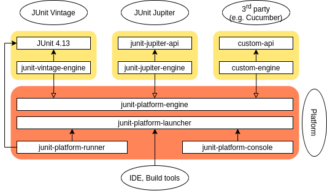
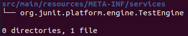

## JUnit5 Platform and Engines

---

## The new Architecture
JUnit5 is composed of 3 main subprojects:



---

## How does the Launcher work?
The Launcher is the entry point for client code that wishes to **discover**, filter and **execute** tests using one or more test engines.

---

### Discovery Phase

```java [2-5|6-8|9|12]
LauncherDiscoveryRequest request = LauncherDiscoveryRequestBuilder.request()
    .selectors(
        selectPackage("com.example.mytests"),
        selectClass(MyTestClass.class)
    )
    .filters(
        includeClassNamePatterns(".*Tests")
    )
    .build();

try (LauncherSession session = LauncherFactory.openSession()) {
    TestPlan testPlan = session.getLauncher().discover(request);

    // ... discover additional test plans or execute tests
}
```

---

### Execution Phase

``` java [6|10|13]
SummaryGeneratingListener listener = new SummaryGeneratingListener();

try (LauncherSession session = LauncherFactory.openSession()) {
    Launcher launcher = session.getLauncher();
    // Register a listener of your choice
    launcher.registerTestExecutionListeners(listener);
    // Discover tests and build a test plan using the previous LauncherDiscoveryRequest
    TestPlan testPlan = launcher.discover(request);
    // Execute test plan
    launcher.execute(testPlan);
}

TestExecutionSummary summary = listener.getSummary();
```

---

## Test Engine
A `TestEngine` facilitates **discovery** and **execution** of tests for a particular **programming model**.

---

### When to create a custom TestEngine?
- Tests are written using a DSL, like Gherkin for Cucumber <!-- .element: class="fragment" data-fragment-index="1" -->
- Tests are auto-generated or downloaded at runtime <!-- .element: class="fragment" data-fragment-index="2" -->
- The junit-jupiter extension model is not powerful enough, like with JQwik <!-- .element: class="fragment" data-fragment-index="3" -->

---

### How to register a TestEngine?
- **(Preferred way)** Using the `ServiceLoader` mechanism

    

With content

```
my.project.engine.CustomTestEngine
```

- Hard-coding the engine class name in a `LauncherConfig` object, used to configure the `Launcher`

---

### Demo

---

## Cucumber case

``` java [3|6]
private LauncherDiscoveryRequest createLauncherDiscoveryRequest(List<Class<?>> testClasses) {
    List<DiscoverySelector> classSelectors = testClasses.stream()
        .map(DiscoverySelectors::selectClass)
        .collect(Collectors.toList());

    LauncherDiscoveryRequestBuilder requestBuilder = LauncherDiscoveryRequestBuilder.request().selectors(classSelectors);

    addTestNameFilters(requestBuilder);
    addEnginesFilter(requestBuilder);
    addTagsFilter(requestBuilder);

    return requestBuilder.build();
}
```

<p class="fragment" data-fragment-index="11"> Problem: Java plugin for Gradle allows test discovery by <code>ClassSelector</code>s only </p>

---

### Cucumber Workaround
2 possible ways:
- Forcing the creation of a dummy class annotated with `@Cucumber`
- Using the `JUnit Platform Console Launcher`
