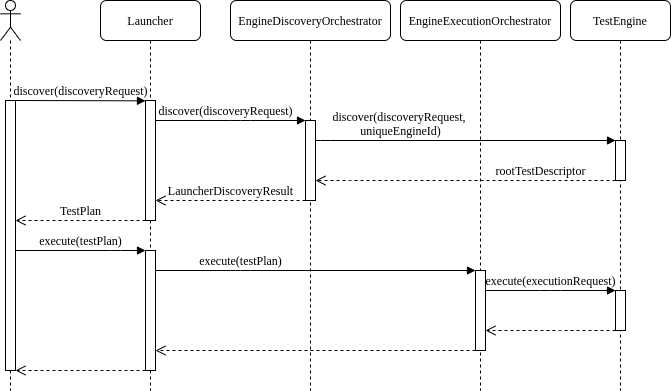

## JUnit5 Platform and Engines

---

## The new Architecture
JUnit5 is composed of 3 main subprojects:


---

## How does the Launcher work?
The `Launcher` is the entry point for client code that wishes to **discover**, filter and **execute** tests using one or more test engines.

---

### Discovery Phase

```java [2-5|6-8|9|12]
LauncherDiscoveryRequest request = LauncherDiscoveryRequestBuilder.request()
    .selectors(
        selectPackage("com.example.mytests"),
        selectClass(MyTestClass.class)
    )
    .filters(
        includeClassNamePatterns(".*Tests")
    )
    .build();

try (LauncherSession session = LauncherFactory.openSession()) {
    TestPlan testPlan = session.getLauncher().discover(request);

    // ... discover additional test plans or execute tests
}
```

---

### Execution Phase

``` java [6|10|13]
SummaryGeneratingListener listener = new SummaryGeneratingListener();

try (LauncherSession session = LauncherFactory.openSession()) {
    Launcher launcher = session.getLauncher();
    // Register a listener of your choice
    launcher.registerTestExecutionListeners(listener);
    // Discover tests and build a test plan using the previous LauncherDiscoveryRequest
    TestPlan testPlan = launcher.discover(request);
    // Execute test plan
    launcher.execute(testPlan);
}

TestExecutionSummary summary = listener.getSummary();
```

---

## Test Engine
A `TestEngine` facilitates **discovery** and **execution** of tests for a particular **programming model**.

---

### When to create a custom TestEngine?
- Tests are written using a DSL, like Gherkin for Cucumber <!-- .element: class="fragment fade-in-then-semi-out" data-fragment-index="1" -->
- Tests are auto-generated or downloaded at runtime <!-- .element: class="fragment fade-in-then-semi-out" data-fragment-index="2" -->
- The extension model of Jupiter is not powerful enough, like with JQwik <!-- .element: class="fragment fade-in-then-semi-out" data-fragment-index="3" -->

---

### How to register a TestEngine?
- **(Preferred way)** Using the `ServiceLoader` mechanism

    

With content

```
my.project.engine.CustomTestEngine
```

- Hard-coding the engine class name in a `LauncherConfig` object, used to configure the `Launcher`

---

### First Approach: `implements TestEngine`

1. discover(discoveryRequest):

    

2. execute(executionRequest): visit the tree and execute tests

---

### Second Approach: `extends HierarchicalTestEngine<MyContext>`
The discovery phase is identical to the first approach, but there is no execution phase and every descriptor has a definition similar to:

``` java [2|3]
public class MyTestDescriptor 
    extends AbstractTestDescriptor
    implements Node<MyEngineExecutionContext>
```

---

### What happens with `gradle test`?



---

## Demo

---

## Cucumber case
This is how the `java` plugin for Gradle builds a discovery request:

``` java [3|6]
private LauncherDiscoveryRequest createLauncherDiscoveryRequest(List<Class<?>> testClasses) {
    List<DiscoverySelector> classSelectors = testClasses.stream()
        .map(DiscoverySelectors::selectClass)
        .collect(Collectors.toList());

    LauncherDiscoveryRequestBuilder requestBuilder = LauncherDiscoveryRequestBuilder.request().selectors(classSelectors);

    addTestNameFilters(requestBuilder);
    addEnginesFilter(requestBuilder);
    addTagsFilter(requestBuilder);

    return requestBuilder.build();
}
```

<p class="fragment" data-fragment-index="1">Problem:  <code>.feature</code> files are not classes</p>

---

### Cucumber Workaround
2 possible ways:
<ul>
    <li class="fragment fade-in-then-semi-out" data-fragment-index="1">
        Forcing the creation of a dummy class annotated with <code><span style="color: yellow">@Cucumber</span></code>
    </li>
    <li class="fragment fade-in-then-semi-out" data-fragment-index="2"> 
        Using the JUnit Platform Console Launcher with the <code>--scan-classpath</code> option
    </li>
</ul>

---

## The <code><span style="color: yellow">@Testable</span></code> annotation

<span style="color: yellow">`@Testable`</span> is used to signal to IDEs and tooling vendors that the annotated or meta-annotated element is *testable*.


---

## Filters

<ul>
    <li class="fragment fade-in-then-semi-out" data-fragment-index="1">
        <b><code>DiscoveryFilter</code></b>: are applied during test discovery, e.g. <code>ClassNameFilter</code>
    </li>
    <li class="fragment fade-in-then-semi-out" data-fragment-index="2"> 
        <b><code>PostDiscoveryFilter</code></b>: can be registered using the <code>ServiceLoader</code> and prune the final <code>TestDescriptor</code> tree
    </li>
</ul>

---

## Listeners

- LauncherSessionListener <!-- .element: class="fragment fade-in-then-semi-out" data-fragment-index="1" -->
- LauncherDiscoveryListener <!-- .element: class="fragment fade-in-then-semi-out" data-fragment-index="2" -->
- TestExecutionListener <!-- .element: class="fragment fade-in-then-semi-out" data-fragment-index="3" -->
- EngineExecutionListener <!-- .element: class="fragment fade-in-then-semi-out" data-fragment-index="4" -->
- ... <!-- .element: class="fragment fade-in-then-semi-out" data-fragment-index="5" -->

---

## Sources

- [Official Documentation](https://junit.org/junit5/docs/snapshot/user-guide/index.html#launcher-api)
- [Implementing a Custom JUnit5 Test Engine, Software matters](https://software-matters.net/posts/custom-test-engine/)
- [Talk on `TestEngine`s (in German)](https://vimeo.com/236707523)
- [A lot of Github repositories](https://github.com/junit-team/junit5/wiki/Third-party-Extensions#junit-platform-test-engines)
